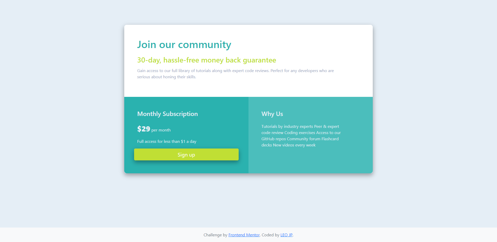

# Frontend Mentor - Single price grid component solution

This is a solution to the [Single price grid component challenge on Frontend Mentor](https://www.frontendmentor.io/challenges/single-price-grid-component-5ce41129d0ff452fec5abbbc). Frontend Mentor challenges help you improve your coding skills by building realistic projects. 

## Table of contents

- [Overview](#overview)
  - [The challenge](#the-challenge)
  - [Screenshot](#screenshot)
  - [Links](#links)
- [My process](#my-process)
  - [Built with](#built-with)
  - [What I learned](#what-i-learned)
  - [Continued development](#continued-development)
  - [Useful resources](#useful-resources)
- [Author](#author)

**Note: Delete this note and update the table of contents based on what sections you keep.**

## Overview

### The challenge

Users should be able to:

- View the optimal layout for the component depending on their device's screen size
- See a hover state on desktop for the Sign Up call-to-action

### Screenshot
See more designs [here](./design).


### Links

- Solution URL: [Add solution URL here](https://your-solution-url.com)
- Live Site URL: [Add live site URL here](https://your-live-site-url.com)

## My process

### Built with (in-order)

- Semantic HTML5 markup
- CSS & SCSS custom properties
- Flexbox
- CSS Grid
- Mobile-first design workflow
- [Bootstrap](https://getbootstrap.com/docs/5.0/getting-started/introduction/)

### What I learned
#### [HTML5](https://www.w3.org/html/logo/)
##### Import basic css
```html
<head>
  <link rel="stylesheet" href="<path>/bootstrap/dist/css/bootstrap.min.css"/>
  <link rel="stylesheet" href="<path>/bootstrap/dist/css/bootstrap-grid.min.css"/>
</head>
```

##### Import basic javascript
```html
<body>
  <script source="./node_modules/bootstrap/dist/js/bootstrap.bundle.min.js"></script>
  <script source="./node_modules/bootstrap/dist/js/bootstrap.min.js"></script>
</body>  
```

##### Sticky Footer 
* [Bootstrap v.5 sticky footer](https://getbootstrap.com/docs/5.0/examples/#custom-components)
* Key Points for a better display of footer
  * Using [flex](https://getbootstrap.com/docs/4.0/utilities/flex/) and [flex-shrink](https://cssreference.io/property/flex-shrink/)
  * Using `footer` & `container` class
  * `d-flex flex-column`: set to vertical direction.
  * `flex-shrink-0`: element will not shrink
```html
<!--This type of HTML structure does not let footer overlap the main contents-->
<!doctype html>
<html lang="en" class="h-100">
  <head>...</head>
  <body class="d-flex flex-column h-100">
    <main class="flex-shrink-0"> 
      ...
    </main>
    <footer class="footer mt-auto py-3 bg-light">
      <div class="container">
        ...
    </footer>
  </body>
</html>
```

##### Force columns to break to new line
```html
 <div class="w-100"></div>
```

##### Stacking divs horizontally & centering a container followed by custom css
```html
<div class="container-fluid container-component">...</div>
```


#### Sass/Scss & CSS
##### [Sass Installation & basic usage](https://webdesign.tutsplus.com/tutorials/watch-and-compile-sass-in-five-quick-steps--cms-28275)
1. npm install sass or yarn add sass
2. add the script in package.json to compile & run sass
3. To compile and run: `npm run scss` or `yarn run scss`
```json
  "scripts": {
    "test": "echo \"Error: no test specified\" && exit 1",
    "scss": "sass --watch <scss>:<css>"
  },
```
1. `node-sass`: Refers to the node-sass package.
2. `--watch`: An optional flag which means “watch all .scss files in the scss/ folder and recompile them every time there’s a change.”
3. `styles/scss`: The folder name where we put all our .scss files.
4. `-o styles/css`: The output folder for our compiled CSS.

##### Getting started with Sass 
* [Variables - Maps](https://sass-lang.com/documentation/values/maps)

##### CSS Grid System Classes
The Bootstrap grid system has [four classes](https://www.w3schools.com/bootstrap/bootstrap_grid_system.asp):

* xs (for phones - screens less than 768px wide)
* sm (for tablets - screens equal to or greater than 768px wide)
* md (for small laptops - screens equal to or greater than 992px wide)
* lg (for laptops and desktops - screens equal to or greater than 1200px wide)

##### Sass/Css Media Queries
Rule of thumb: to apply the style based on device's width/height, use the same structure *as is!* 
```css
div.main {
  &.sub {
      // default style 
  }
}

@media <option> <condition> and ( <width/height> ) {
  div.main {
    &.sub {
      // new style
    }
  }
}
```

#### Github
* [What to do when you commit to the wrong git branch](https://www.clearvision-cm.com/blog/what-to-do-when-you-commit-to-the-wrong-git-branch/)

* [How to Create a Free Website Using GitHub Pages](https://www.youtube.com/watch?v=o5g-lUuFgpg)
  * [Github Pages deployment with NoJekyll](https://github.com/leo-jp/sandbox). This sample repository shows how to ignore Jekyll excluding node_modules and including specific modules (e.g. bootstrap) as well.


### Continued development

* Do mobile-first design development
* Add data connection, routers, and state management using ReactJS, VueJS, etc.
* Enable database connection and associate it with Javascripts.
* Follow Web security best practices 


### Useful resources

- [Visual Studio Live Server by Ritwick Dey](https://marketplace.visualstudio.com/items?itemName=ritwickdey.LiveServer) - easy compile & run to display changes realtime.

- [Chrome Extension Go Full Page](https://chrome.google.com/webstore/detail/gofullpage-full-page-scre/fdpohaocaechififmbbbbbknoalclacl?hl=en) - A free screenshot application.

- [W3 Bootstrap grid system ](https://www.w3schools.com/bootstrap/bootstrap_grid_system.asp) - This helped me understand the scope of media when using grid system. 

- [Sass Documentation](https://sass-lang.com/documentation) - Helped me to familiarize with Sass/Scss basics to advance scripting.

- [CSS Sticky Footer](https://getbootstrap.com/docs/5.0/examples/#custom-components) - A life-saver during the course of development! Before, the footer overlaps the main contents but using the same structure of Bootstrap's sticky footer, it works like magic!


## Author
- Frontend Mentor - [@die-lowenkonigin](https://www.frontendmentor.io/profile/die-lowenkonigin)